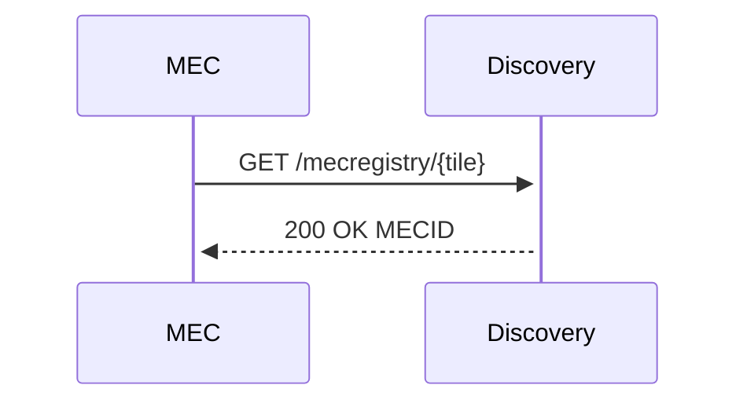
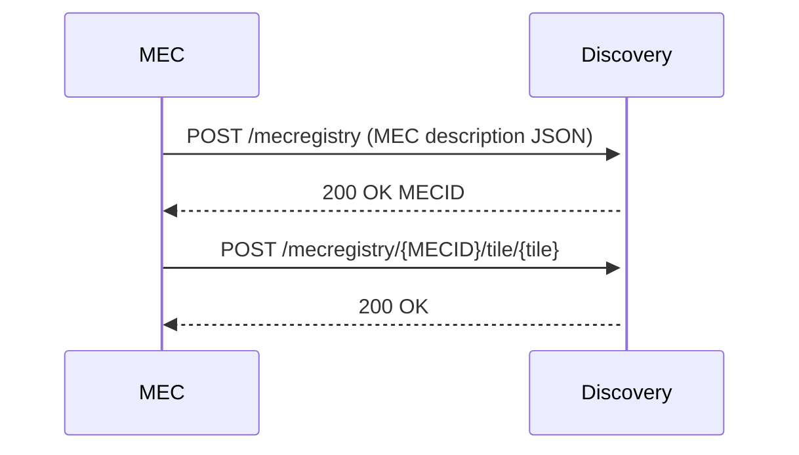
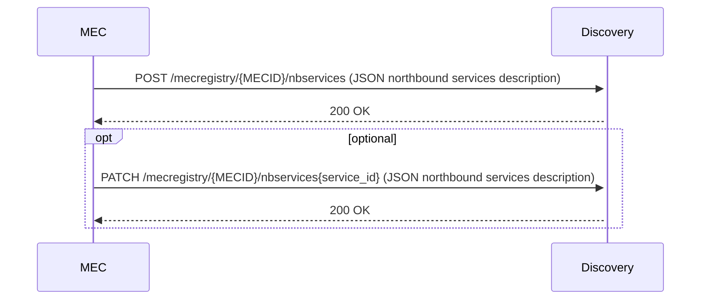
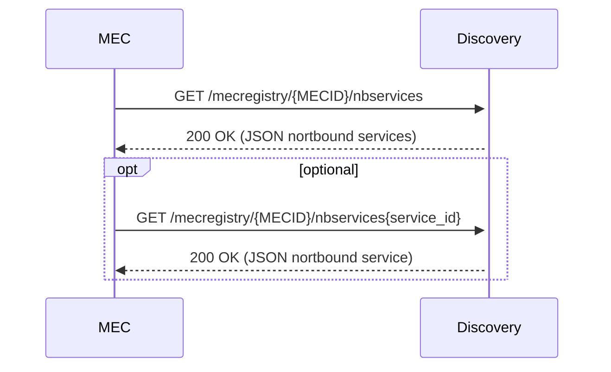
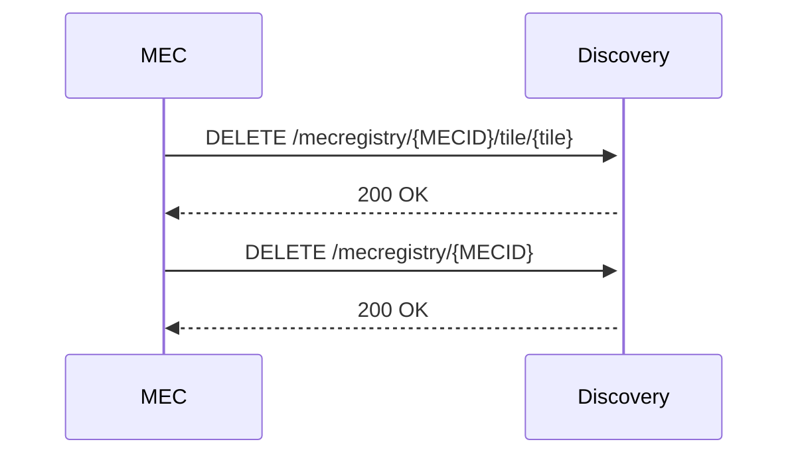

This repository contains all necessary stuff to deploy discovery-api in the 5GMETA Cloud platform.

This API is in charge of managing all neccessary information about MECs and their capabilities, coverage zones (tiles) and services provided by them to 3rd party applications and to 5GMETA platform members.

# Requisites

This API has to be deployed in a Kubernetes running environment. 

It needs access to:
 - a sql database called dataflowdb defined by [https://github.com/5gmeta/dataflow_cloud/blob/main/src/mysql/dataflow_DB_CLOUD_mysql.sql](https://github.com/5gmeta/dataflow_cloud/blob/main/src/mysql/dataflow_DB_CLOUD_mysql.sql) and
 - a database discoverydb defined by [https://github.com/5gmeta/discovery/blob/main/src/data/sql/database.sql](https://github.com/5gmeta/discovery/blob/main/src/data/sql/database.sql). 

Please refer to [https://github.com/5gmeta/platform-config/blob/main/docs/cloud-database.md](https://github.com/5gmeta/platform-config/blob/main/docs/cloud-database.md) to get more information about database deployment.


# Source code

Source code can be found on [/src/python-flask-server-generated](/src/python-flask-server-generated)

# Building image

Go to [/src/python-flask-server-generated](/src/python-flask-server-generated):

```
docker build -t swagger_server .
```

Please refer to  [/src/python-flask-server-generated/README.md](/src/python-flask-server-generated/README.md) to get more information about building.

# Deployment

Deployment of discovery API in the production environment has to be made by deploying the helmchart defined on [https://github.com/5gmeta/helmcharts/tree/main/charts/discoveryapi-chart](https://github.com/5gmeta/helmcharts/tree/main/charts/discoveryapi-chart) 

To do this please follow instructions from [https://github.com/5gmeta/platform-config/blob/main/docs/cloud-modules-deployment.md](https://github.com/5gmeta/platform-config/blob/main/docs/cloud-modules-deployment.md).

# Examples

Some usage examples can be found in [examples](examples) folder. Please refer to [examples/README.md](examples/README.md)

# Interactions 

The different functions provided are depicted in different diagrams:

## Get MECID containing a Tile



## Register a new MEC



## Register northbound services into a MEC



## Get northbound from MEC



## Get northbound services from given MEC


## Delete a MEC




## Authors

* Felipe Mogollón ([fmogollon@vicomtech.org](mailto:fmogollon@vicomtech.org))


## License

Copyright : Copyright 2022 VICOMTECH

License : EUPL 1.2 ([https://eupl.eu/1.2/en/](https://eupl.eu/1.2/en/))

The European Union Public Licence (EUPL) is a copyleft free/open source software license created on the initiative of and approved by the European Commission in 23 official languages of the European Union.

Licensed under the EUPL License, Version 1.2 (the "License"); you may not use this file except in compliance with the License. You may obtain a copy of the License at [https://eupl.eu/1.2/en/](https://eupl.eu/1.2/en/)

Unless required by applicable law or agreed to in writing, software distributed under the License is distributed on an "AS IS" BASIS, WITHOUT WARRANTIES OR CONDITIONS OF ANY KIND, either express or implied. See the License for the specific language governing permissions and limitations under the License.
